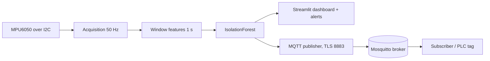

# Architecture

```mermaid
flowchart LR
  S[MPU6050 over I2C] --> A[Acquisition 50 Hz]
  A --> F[Window features 1 s]
  F --> M[IsolationForest]
  M --> D[Streamlit dashboard + alerts]
  M --> Q[MQTT publisher, TLS 8883]
  Q --> B[(Mosquitto broker)]
  B --> X[Subscriber / PLC tag]
```
